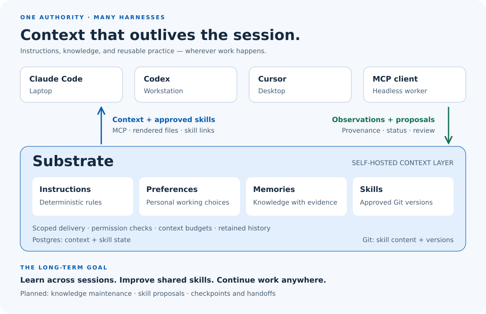

<p align="center">
  <picture>
    <source media="(prefers-color-scheme: dark)" srcset="docs/assets/hero-dark.svg">
    
  </picture>
</p>

<h1 align="center">Substrate</h1>

<p align="center"><strong>A self-hosted control plane that makes AI coding agents disposable by making their context durable.</strong></p>

<p align="center">
  One source of truth for instructions, memory, and skills —<br>
  served to Claude Code, Codex, Cursor, or any headless worker, on any machine.
</p>

<p align="center">
  <a href="ROADMAP.md">Roadmap</a> ·
  <a href="docs/product/problem.md">Why</a> ·
  <a href="docs/design/edd.md">Design</a> ·
  <a href="CONTRIBUTING.md">Contribute</a>
</p>

<p align="center">
  
  
  
  
</p>

> Status: **pre-alpha.** Phase 1 (authority + sync) is under construction. Nothing here is
> stable yet; [ROADMAP.md](ROADMAP.md) says what "done" means at each horizon.

---

Every coding harness treats the **agent as durable and its knowledge as disposable**. Substrate is built on the opposite premise: the agent is the throwaway part. What it learned, what it was told, and what it's allowed to do should outlive it — and follow you to the next harness, the next laptop, the next teammate.

## Why

You already pay this tax. It just doesn't show up on one line item.

| What you do today | What it costs |
|---|---|
| Copy `CLAUDE.md` / `AGENTS.md` / `.cursor/rules` between machines | Two machines disagree. Neither is right. |
| Re-explain the project every session | Minutes, per session, per harness |
| Let each harness keep its own memory | Knowledge stranded on whichever box learned it |
| Finish the job where you started it | Can't hand a long run to the GPU box |
| Trust what the agent "remembers" | Confident action on facts the code no longer honors |

The cost recurs, and it multiplies: **harnesses × machines × people**.

Substrate collapses it to one function —

```
(global → org → team → project → repo → branch → task → session) + user overlay
                     → effective context
```

— compiled once, served everywhere, with what agents learn flowing *back* under provenance and trust. Full framing: [`docs/product/problem.md`](docs/product/problem.md).

## What makes it different

Shared agent memory is a crowded space, and three of the four layers here are borrowed deliberately — Agent Skills for the skill format, board-as-control-plane for orchestration, transcript-slug resumption for migration. What no surveyed project offers is this combination on **one store**:

- **A scope chain.** `global → org → team → project → repo → branch → task → session`, with `user` as an orthogonal overlay. Every table uses it. So does the compiler.
- **Deterministic instructions.** Rules are a first-class table, never scored, never budget-trimmed. *A rule that is sometimes present is worse than no rule.*
- **Provenance and trust on memory.** Every fact carries who wrote it, how it was verified, and its status: `unverified → probable → confirmed`. A low-trust agent can never quietly demote a human-confirmed fact.
- **Budgeted compilation, explainable by design.** The pack is compiled under a token budget with instructions exempt; `context.explain` — why an item is in the pack, and why another is not — is a Next-horizon item.
- **Local files as caches.** `CLAUDE.md` is a *rendering* of the store, emitted byte-deterministically. The adapter that turns a hand-edit into a reviewable diff rather than a silent merge is Phase 1 work in progress.

Reasoning, and what we're deliberately *not* building: [`docs/product/positioning.md`](docs/product/positioning.md), [`docs/product/non-goals.md`](docs/product/non-goals.md).

## Works with

| Harness | Substrate renders | Captures via | Continuity |
|---|---|---|---|
| Claude Code | `CLAUDE.md` (`@AGENTS.md` + hooks block) | `PostToolUse` hook → outbox observation (**CAP-1a capture**, ships today); `SessionStart` → `context.get` *(CAP-1a context, Phase 2)* | checkpoint *(Phase 2)* |
| Codex | `AGENTS.md`, `~/.codex/AGENTS.md` | hooks *(Phase 2)* | checkpoint *(Phase 2)* |
| Cursor | `~/.cursor/rules/substrate.mdc` | read-only | checkpoint *(Phase 2)* |
| Headless workers | context pack over MCP (`context.get`) | `memory.*` MCP tools | lease + checkpoint *(Phase 6)* |

Rendering, skill linking, and `PostToolUse` capture ship today; `SessionStart` context injection and continuity are designed and phased, not shipped. The `PostToolUse` hook is installed by merging an entry into `~/.claude/settings.json` — a user-owned file Substrate merges into rather than owns: the merge is idempotent, unrelated keys are preserved, the pre-existing file is copied once to `settings.json.pre-substrate`, and `substrate adapter uninstall` removes the entry surgically — everything else you have written since stays, and the `.pre-substrate` copy is kept as your archive rather than written back over your edits. The shim (`substrate-adapter hook posttooluse`) reads the hook JSON on stdin, derives its scope from the checkout's git remote, exits within 2 seconds, and always exits 0 — a capture failure never fails the tool call, and a cwd whose remote is not bound is logged and skipped rather than filed anywhere else. Skills use the [Agent Skills](https://agentskills.io) `SKILL.md` format — Git holds skill content, Substrate holds skill state (`skill_version.git_sha` is the only link). The adapter materializes the active approved `git_sha` into `~/.agents/skills/<name>` and refreshes harness symlinks; a skill whose scope or visibility does not match this machine is omitted from `GET /v1/skills/manifest` and is not linked. `active_version_id` can only point at an approved version (Postgres trigger, R6).

## Quickstart

Requires Go 1.26.6+ (the floor in `go.mod`; earlier 1.26 patches carry stdlib CVEs that `govulncheck` fails CI on).

```sh
git clone https://github.com/agentic-substrate/substrate.git && cd substrate

make build     # binaries into ./bin
make smoke     # boots the real server against empty state and hits it
make check     # everything CI runs: fmt, vet, lint, race tests, govulncheck
```

Run the server, then get from clone to an authenticated, scope-aware command in three steps:

```sh
./bin/substrate-server -addr :8080 -dsn 'postgres://…'
curl localhost:8080/healthz
curl localhost:8080/readyz

# 1. create the first user principal (database-gated; prints its token once)
./bin/substrate admin create-user --dsn "$SUBSTRATE_DSN" \
    --name ada --org acme --team platform --admin

# 2. store it. The token is read from stdin, never argv, and written 0600.
./bin/substrate auth login --server http://localhost:8080 < token.txt

# 3. say where you work; `context show` prints the winning source
./bin/substrate context use --org acme --team platform
./bin/substrate context show

./bin/substrate doctor        # config, credential, server, scope

./bin/substrate token mint --for agent --parent <user-uuid> --machine wsl \
    --scopes memory:write --dsn "$SUBSTRATE_DSN"

./bin/substrate import scan --root /abs/machine-root --hostname wsl \
    --out /abs/path/inventory.json [--memorix-json /abs/path/memorix.json] \
    [--exclude 'some/fixtures/**']
./bin/substrate import plan --out /abs/path/plan.json /abs/path/inventory.json
./bin/substrate import apply --machine mac --trusted mac \
    --server "$SUBSTRATE_URL" --token "$TOKEN" \
    --scope 'global:/org:acme/team:core/project:plotlens' \
    /abs/path/plan.json

./bin/substrate review list --server "$SUBSTRATE_URL" --token "$TOKEN"
./bin/substrate review approve <id> --reason 'keep wsl' \
    --hostname wsl --as-kind instruction \
    --server "$SUBSTRATE_URL" --token "$TOKEN"
./bin/substrate review reject <id> --reason 'superseded by the mac copy' \
    --server "$SUBSTRATE_URL" --token "$TOKEN"

./bin/substrate adapter status --root /abs/home --root /work \
    --server "$SUBSTRATE_URL" --token "$TOKEN" --machine wsl
./bin/substrate adapter install --root /abs/home --root /work \
    --server "$SUBSTRATE_URL" --token "$TOKEN" --machine wsl
./bin/substrate adapter uninstall --root /abs/home --root /work [--force]
```

Point any MCP client at `POST /mcp` with that bearer token. Phase 1 exposes `context.get`, `memory.write`, `memory.search`, and `memory.supersede`. Agents always write `unverified`; supersede never deletes.

<details>
<summary><strong>Operational detail</strong> — health, embeddings, the <code>/v1</code> surface, configuration</summary>

`-dsn` (or `SUBSTRATE_DSN`) is the Postgres connection string. The server listens first. If a
DSN is set, it applies goose migrations under an advisory lock and retries in the background
rather than exiting. `/healthz` is **200** whenever the process is alive. `/readyz` returns
**200** only after migrations have applied and the pool can ping Postgres; otherwise **503**.
Without a DSN, `/readyz` is 503 `store not configured`. `/readyz` does not check Git or the
skills repo (EDD R27).

`-ollama` (or `SUBSTRATE_OLLAMA_URL`) points at Ollama for embeddings — `nomic-embed-text`, 768
dimensions, called directly from Go with no Python in the request path (EDD R21). Leave it empty
and retrieval is keyword-only, which is a supported configuration rather than a degraded one:
`memory.search` must never fail because embeddings are unavailable (MEM-5). When it is set, a
write whose embed call fails still succeeds with `embedding NULL` and is picked up by the
backfill pass. Semantic similarity is capped below the score of an exact identifier hit, so a
vector neighbour can never outrank a typed filename or symbol (MEM-3).

`-otlp` (or `SUBSTRATE_OTLP_ENDPOINT`) is the OTLP HTTP collector. Leave it empty and export is
disabled, which is a supported configuration the same way empty `-ollama` is keyword-only: the
collector being down, or never configured, must not fail a request. When set, the process pushes
metrics and traces best-effort; a failure is logged once, not per request. On SIGTERM, shutdown
waits up to 5s for the collector — a hang delays process exit, not in-flight requests. Metric names are
`substrate_*` (the EDD's `acp_*` translated). The adapter reports `substrate_outbox_depth` per
machine, including zero — a machine that stopped reporting drops the series rather than looking
like an empty queue. Phase 1 alert rules live in [`deploy/alerts.yaml`](deploy/alerts.yaml).

`POST /mcp` is the streamable-HTTP MCP endpoint (EDD §4.1). Bearer auth is required;
unauthenticated requests are rejected before the MCP handler runs. Rate limiting is Traefik's
job, not the process. `context.get` compiles instructions, preferences, mandatory items,
keyword-retrieved memories, and a skill index under the documented conservative token estimator;
instructions, preferences, and mandatory items are never trimmed.

`/v1` is the adapter and CLI REST surface (EDD §4.2), behind the same bearer auth as `/mcp` and
not exposed to harnesses. It serves `GET /v1/render`, `GET /v1/skills/manifest`,
`POST /v1/memory/batch`, `GET /v1/memory/cache`, review create/list/decide, `POST /v1/import`,
`GET /v1/events`
(SSE wake-ups when `substrate_audit` fires; the payload carries no audit metadata), and
`GET /v1/health/git`. `/v1/memory/batch` is the idempotency boundary: `ingest_receipt` and the
memory row are created in one transaction, and a replay with a known `client_id` returns the
original id with `duplicate: true`. Render `sha256` values are `render.DriftHash` of the content
(footer excluded). `POST /v1/import` consumes a `plan.json` (SYNC-5, EDD §9). The most-trusted
machine is applied first; only its non-conflict blocks that are not already byte-identical to
an active row become `active`. The first successful trusted commit stores a per-scope
marker; a later `-trusted` that names a different host is rejected, including when the
later host uses a different token. Every later machine can only add `proposed` rows and
`import_conflict` review items — it cannot promote anything to `active` or modify a row the
trusted machine established. Each conflict payload carries the applying `hostname` and the
pair sides' hostnames. Imported memory is always `episodic`/`unverified` even when the source
claimed `confirmed` (Gotcha 4). A replay of the same machine+plan is idempotent via
`ingest_receipt` keyed on `(machine, scope, plan-hash)`; an optional `client_id` is an
alias of that key, never a second write. `dry_run` is the default: the server classifies and returns the planned set
grouped by hostname without opening a write transaction. Writes require `"commit": true`.

Tokens are printed once and stored only as a SHA-256 hash; agent tokens expire in 24 hours
(EDD R3). `token mint --for agent` is the only accepted kind: user principals come from
`substrate admin create-user`, which is the only path in the codebase that creates one. Revoke
with `./bin/substrate token revoke <token> --dsn "$SUBSTRATE_DSN"`. `./bin/substrate` with no
arguments now prints help; `./bin/substrate --version` reports the version, and an unrecognised
verb exits non-zero with a suggestion rather than exiting 0.

### The command tree

Every verb is a cobra command, so `-h` works on the root, on each command and on each
subcommand. There is no `-dry-run`/`-commit` pair anywhere: a preview is its own verb
(`import scan`, `import plan`, `adapter status`), and every writing verb echoes the scope it
resolved, then confirms — off a TTY it refuses without `--yes`.

| Command | What it does |
|---|---|
| `substrate admin create-user` | Creates org, team, user principal, membership and token in one transaction. Requires the DSN. Prints the token once. `--admin` mints at `human_admin` trust **and** joins the team as its admin; without it the principal is `human` at `member` role. Reusing an existing `--org`/`--team` attaches to that row rather than creating a second one. |
| `substrate auth login` | Reads a token from **stdin**, validates it against the server, writes `config.json` 0600. |
| `substrate auth status` | Reports the stored server and whether a token is present. Never prints the token. |
| `substrate context use` | Saves an org/team/project as the default scope. |
| `substrate context show` | Prints the resolved scope and the source that won. |
| `substrate doctor` | Checks config, credential, server reachability and scope; prints a fix per failure. A 401 is a bad credential and says to mint one; a 403 means the token authenticated and the *policy* refused, so it says to fix scope or access, not to mint again. |
| `substrate import scan` | Inventories harness files under one or more `--root`s into `inventory.json`. Writes nothing to the control plane. |
| `substrate import plan` | Merges inventories into a reviewable `plan.json`. Writes nothing to the control plane. |
| `substrate import apply` | Sends a plan to `POST /v1/import` (this commits). Echoes the resolved scope and its source, then confirms. |
| `substrate review list` | Shows queued review items. |
| `substrate review approve` / `reject` | Records one decision (this commits). The decision is the verb, so there is no `--decision`; `--reason` is required on `reject`. |
| `substrate adapter status` | Classifies what `install` would displace. Writes nothing. |
| `substrate adapter install` | Displaces harness files with rendered context and installs the adapter unit (this commits). Echoes the roots and every file it will displace, then confirms. |
| `substrate adapter uninstall` | Restores every displaced `*.pre-substrate` file and removes the unit (this commits). Echoes the roots and every file it will restore or remove, then confirms. `--force` discards live edits that no longer match the hash `install` wrote — the drift-recovery path in the runbook. |
| `substrate token mint` / `revoke` | Mints or revokes a principal token straight against Postgres. Requires the DSN. |

Every command takes `--json` for machine-readable output and `--org/--team/--project` to
override the saved scope for one invocation. A chain resolves org before team before
project, so a partial chain — `--team eng` with no `--org` — is refused locally with the
missing level named, rather than sent as a scope string no server can bind.

### Scope resolution

First hit wins, and `context show` names the winner:

1. explicit `--org` / `--team` / `--project` flags (partial is allowed);
2. `${XDG_CONFIG_HOME:-~/.config}/substrate/context.json`, written by `context use`;
3. this checkout's `origin` remote, sent as a **repo key** in the `repo` field — never as a
   scope string, because binding a remote to a chain is the server's job (R18);
4. otherwise an error naming the next command. There is no global default: guessing `global:`
   would file work at a scope the caller may not write.

### Config files

`${XDG_CONFIG_HOME:-~/.config}/substrate/` holds `config.json` (server plus token) and
`context.json`. Both are written mode 0600 via a temp file that is `fsync`ed, renamed into
place, and followed by an `fsync` of the directory — so a crash mid-write leaves either the
previous file or the new one, never a truncated or zero-length credential. `config.json` is **refused on load** if any group or other bit
is set — `chmod 600` it, the way ssh requires of a private key. That refusal reaches you verbatim from every command that falls back to the saved credential, rather than being reported as a missing token: a world-readable credential is the more urgent news. Substrate never guesses `$HOME`:
if `os.UserConfigDir()` fails, the error is propagated and the command stops.

Note that a **user token does not expire**. `identity.Lookup` TTL-caps agent tokens only, so
`config.json` is a long-lived credential on disk. Keep its mode 0600 and revoke the token with
`substrate token revoke` when a machine is retired.

### Exclude the corpus that should never be imported

`--exclude` takes a glob matched against each file's path relative to its root; `**` spans
separators, and the flag repeats. **Set it before the first import.** A home directory holds far
more `AGENTS.md`/`CLAUDE.md` files than it has real configuration: git worktree checkouts each
carry a copy of their repo's file, skill eval fixtures carry deliberately synthetic ones, and a
dependency directory like `.nvm` carries someone else's project entirely.

Measured on one real home (2026-09-08), the difference between scanning everything and scanning
only the primary checkouts:

| | Files | Blocks | Conflicts | Slots | Slots >1 block |
|---|---|---|---|---|---|
| No excludes | 56 | 861 | 79 | 301 | 136 |
| Excludes below | 18 | 459 | 22 | 126 | 69 |

Conflicts are the population a human has to key by hand, so the 79 → 22 drop is the number that
matters. Most of the excluded "conflicts" were worktree copies of one file disagreeing with each
other — noise that reads exactly like a real disagreement between two machines.

**Judge an exclude set by the file list and the conflict count, never the block count.** Blocks
dedupe by content hash and are attributed to the *first* file the walk reaches
(`BuildPlan`'s `byHash` map), so excluding a worktree copy hands its blocks back to the primary
checkout rather than deleting them. Widening the set above from six patterns to fourteen — a strict
superset — took blocks from 271 *up* to 459 while conflicts fell from 71 to 22. More exclusions,
more blocks, better corpus.

```sh
./bin/substrate import scan -root "$HOME" -hostname wsl -out /abs/path/inventory.json \
    -exclude '.nvm/**' \
    -exclude '**/node_modules/**' \
    -exclude '**/eval-*/**' \
    -exclude '**/fixtures/**' \
    -exclude 'worktrees/**' \
    -exclude '**/worktrees/**' \
    -exclude '**/.worktrees/**' \
    -exclude '**/.git-worktrees/**' \
    -exclude 'repos/*-worktrees/**' \
    -exclude 'repos/.wt/**' -exclude 'repos/.wt-*/**' \
    -exclude 'repos/*-wt/**' -exclude 'repos/*-wt-*/**' -exclude 'repos/wt-*/**'
```

### Verify the survivors by hand — the glob list will not catch everything

There is no universal worktree convention, and a missed one is **silent**: the copy is scanned,
its blocks dedupe against the primary checkout's, and the `rel` that survives is whichever file
the walk reached first.

On the home measured above, the exclude list still let two worktrees through — `plotlens-trivy-cve`
and `parley-shots-tshirt` — because they are named after their feature branch and carry no `wt` or
`worktree` token for a glob to match. Assume yours has some too. A worktree's `.git` is a *file*
containing a `gitdir:` pointer, not a directory, which is what distinguishes it from a primary
checkout:

```sh
jq -r '.files[].rel' /abs/path/inventory.json | sort -u        # what the scan kept
jq -r '.files[].path' /abs/path/inventory.json | while read -r f; do
    d=$(dirname "$f")
    [ -f "$d/.git" ] && echo "worktree copy, exclude it: $f"
done
```

Do that before `substrate import apply`. Nothing downstream will tell you a worktree copy got imported.

`substrate import scan` and `substrate import plan` are read-only (SYNC-5, EDD §9). Scan
requires `--root` (repeatable), `--hostname`, and `--out`; plan requires `--out` and one or
more inventory files. `--root` and `--out` must be absolute paths — there is no `$HOME`
default, and the command will not guess one. `-out` is rejected if it falls inside any
`--root` (scan) or equals any inventoried `Path` (plan), and the written file is always
mode `0600`, even when it already existed. Scan never writes, moves, or modifies
anything under the scanned roots; it only writes the file named by `--out`. It inventories
`.claude/CLAUDE.md`, `.codex/AGENTS.md`, `.cursor/rules/`, and any `AGENTS.md` /
`CLAUDE.md` found under those roots. Symlinks are not followed. Memorix is read only from
an operator-exported JSON file passed as `--memorix-json`; scan never execs `memorix`.
If that flag is omitted the source is skipped with a logged reason and the rest of the
scan still succeeds. An unreadable directory under a root is recorded in `skipped` and the
walk continues, so one permission error cannot abort a scan of a real home. Dependency and
plugin caches are never inventoried — a `CLAUDE.md` in the Go module cache or an `AGENTS.md`
in a vendored crate belongs to its upstream author, not to this machine. `--exclude <glob>`
(repeatable) drops anything matching a glob against the root-relative path, where `**` spans
separators; a pattern that is not a valid glob is an error rather than a filter that
silently matches nothing. Plan splits markdown into blocks, **dedupes by content hash**, then
classifies each unique block as `instruction` or `preference`. Classification is heuristic
and will misfile (R15); confidence is never certainty. Identical blocks from two machines
appear once in `plan.json`; differing blocks at the same heading from distinct hostnames
or paths are a conflict pair tagged with hostname. Extra hashes from a single file stay
in `blocks`. `substrate import apply` POSTs that plan to `/v1/import`. It
requires `--machine`, `--trusted` (the most-trusted hostname; apply it first),
`--server` (or `SUBSTRATE_URL`), `--token` (or `SUBSTRATE_TOKEN`), and one
`plan.json`. **`apply` writes.** The reviewable preview is `plan.json` itself,
which is why there is no preview flag: `scan` and `plan` are the read-only
steps.

Where it writes is resolved in order — `--scope`, then the scope recorded in
the context file, then the checkout's `origin` remote, which is sent as `repo`
so the server keeps ownership of the repo-key-to-chain binding (R18). Nothing
is guessed beyond that: an unbound directory with no `--scope` is an error,
never `global:`. The resolved target **and the source that won** are printed
before anything is sent, and `apply` then prompts for confirmation. Off a
terminal — in a script or CI — it refuses without `--yes`, because the server
never discloses the resolved chain afterwards, so an unconfirmed apply in the
wrong checkout is not reviewable in either direction.

Each printed row carries `scope=` and `visibility=`. Imported instructions are
filed at the resolved leaf and are team-visible; imported preferences are filed
at the team scope with `visibility=owner`, so a personal `~/.claude/CLAUDE.md`
does not become readable by the rest of the team on import.

`substrate adapter install` replaces local harness files with `GET /v1/render`
output, renames displaced files and the `.memorix` store to `*.pre-substrate`,
and installs the adapter unit (systemd `--user` on Linux/WSL, launchd on macOS)
with `--root` set to the roots this install displaced, so the daemon never
renders over a tree that has no `*.pre-substrate` backup; with no `--root` that
is `/work` (CONT-4). `--root` is repeatable and absolute, with no
`$HOME` default; omit it to default to `/work`. It also requires `--server`
(or `SUBSTRATE_URL`), `--token` (or `SUBSTRATE_TOKEN`), and `--machine`. Pass
`--root "$HOME" --root /work` so home harness files and checkout files under
the mount root are both displaced. Passing only `--root "$HOME"` does not
add `/work`. **`install` writes**, and prompts first; off a terminal it
requires `--yes`.

`substrate adapter status` is the preview, and it is a verb rather than a flag
so a script cannot mistake it for the real thing: every read, classification,
and conflict check runs, the plan prints each target's current sha256 and the
sha256 it would be replaced by, every `*.pre-substrate` rename, and the unit
that would be installed, and it writes nothing at all — not one installer call.
`status` and `install` share one code path. An existing `*.pre-substrate`
path is an error — that file is the one copy of an earlier cutover and is never
overwritten. Nothing in this flow deletes (Gotcha 6); originals are renamed.
Rendered replacements are compared with `render.DriftHash` (footer excluded).
`status` and `install` differ only in whether the plan is applied, and `install`
prints its roots and every file it is about to displace before it asks for
confirmation.

`substrate adapter uninstall` is the rollback, and it always restores — there
was never a non-restore path, so the old `-restore` flag is gone rather than
required. `--root` is absolute and defaults to `/work` when omitted, exactly as
`install` does, so a rollback cannot walk a different tree than the install it
inverts. Pass the same roots install used
(`--root "$HOME" --root /work`); restore does not discover extra trees. It
plans the restore first and prints its roots and every file it will put back or
remove, then confirms; only then does it rename `*.pre-substrate` back
over the live paths, remove generated files that still match the written
`DriftHash`, and uninstall the unit. Live edits since install are refused
unless `--force` is set (printed as `DISCARD live edits`) — that is the
drift-recovery path, and it survives. Uninstall prompts before restoring and
requires `--yes` off a terminal. Run it
before blaming the server: server data is additive and can be left in place.

`substrate review list`, `approve`, and `reject` are the CLI path through the
import queue (SYNC-5, R15). List calls `GET /v1/review` (default `status=open`) and
prints each item with its id, kind, slot, and both sides tagged by hostname so a
reviewer can choose from the listing. Long bodies are cut at a fixed rune budget
with an explicit `truncated` marker; a side whose hostname is missing is not
decidable in practice. `approve` and `reject` POST `/v1/review/{id}/decide`;
the decision is the verb, so there is no `--decision` to get wrong. **Both
write.** `--reason` is required on `reject`, because a rejection nobody
recorded a reason for cannot be explained later (GOV-2). Both prompt for
confirmation and refuse without `--yes` off a terminal: unlike `import apply`
there is no prior artifact to review, and the id is a UUID that is trivially
pasted wrong. For an
`import_conflict`, `--hostname` selects the winning machine and `--as-kind
instruction|preference` flips a heuristic misfile before approval (R15). A team
lead or `human_admin` decides; the proposer cannot self-approve.

`substrate-adapter` is the per-machine daemon (EDD §5). With no `-server` it reports its
version. With `-server` it pulls `GET /v1/render` on start, every 5 minutes, and on a
`GET /v1/events` SSE wake-up; writes managed files atomically; and posts a `drift_proposal`
(unified diff) *before* restoring a hand-edited file, at the scope of the target being
restored. A rejected or failed proposal degrades that one target — the local file is left
untouched and the loop continues. Comparisons use `render.DriftHash`
(footer excluded). Repo discovery scans `-roots` for any real directory holding a `.git`, up to
two levels below a root, so both the flat `<root>/<repo>` and the nested
`<root>/<project>/<repo>` layouts are found. A symlink under a root is deliberately not a
discovery candidate and is not descended into, so a symlink farm pointing at checkouts
elsewhere is invisible to the daemon; that is what makes the scan loop-free without a cycle
guard. Symlinks *inside* a discovered checkout are unaffected. A checkout's scope comes from
its git remote, never from where it sits on disk, so the same repo gets the same scope under
either layout. A checkout with no remote, an unparseable one, or one the server does not
bind to a repo scope is logged and skipped, and reported in the sync result
(`UnknownRemotes` / `UnscopedRemotes`) so an unmanaged machine is never silently healthy:
unknown remotes are never auto-created as scopes and their checkouts are left untouched.
A drift proposal about a file in a checkout names that checkout's repo key; the server
resolves the key to the chain it bound, so no client is ever told, nor gets to choose,
another team's org/team/project naming. Home-scoped targets such as `~/.claude/CLAUDE.md` have no repo,
so their proposals use `-scope`; without one, drift is reported but the file is not restored.

Each checkout is rendered on its own: the adapter issues one `GET /v1/render` per known
remote and writes that answer only into the checkouts sharing that remote (SCOPE-1, INST-4).
A machine with several repos therefore gets several different `AGENTS.md` / `CLAUDE.md`
files, not one merged blob repeated everywhere. The home-scoped files -- `~/.codex/AGENTS.md`,
`~/.claude/CLAUDE.md`, `~/.cursor/rules/substrate.mdc` -- come from a separate request naming
no repo at all, which the server resolves to the global scope. There is exactly one of each
per machine, so they carry only what is true machine-wide; a repo's own rules reach an agent
through that repo's checked-out files. Branch scope is not part of render yet, so SCOPE-1
stops at `repo`.

`-scope` has **no default**. It applies only to targets that have no repo of their own —
`~/.claude/CLAUDE.md` and outbox observations — and unset means those targets are skipped
and logged. It used to default to `global:`, which was worse than having no default: an
agent token may not write at global or org scope (`internal/policy`), so the two guards
that check for an unset scope never fired, and the work was filed and refused by the server
instead of being skipped locally.
Render targets are confined to the paths `render.Specs()` declares, under `-home` or a
discovered checkout, with symlinks resolved. `-home` is required with `-server` so the binary
cannot guess `$HOME` and overwrite pre-cutover harness files. State lives in
`<home>/.substrate/adapter.sqlite` (override with `-state`). The outbox drains
hook-captured observations to `POST /v1/memory/batch` in batches of at most 50, with a
UUIDv7 `client_id` assigned at enqueue and never regenerated on retry; a replayed id is
success (`duplicate: true`). The offline cache is an FTS5 delta of confirmed/probable
memory for remotes present on the machine, pulled from `GET /v1/memory/cache`. Hook-path
calls use a 1.5s server timeout and fall back to the outbox (writes) or the cache (reads)
so they return in under 2s. The skills loop runs on the same tick as render: `GET
/v1/skills/manifest`, `git fetch` of `-skills-repo` into `<home>/.substrate/skills.git`,
export of each approved `git_sha` into `<home>/.agents/skills/<name>`, and symlinks into
`.claude/skills`, `.codex/skills`, and `.cursor/skills`. A skills-repo outage keeps the last
linked versions and does not affect `/readyz`.

```sh
./bin/substrate-adapter -server https://cp.example -token "$TOKEN" \
  -home "$HOME" -roots /work -machine wsl -skills-repo git@github.com:org/skills.git
```

**Configuration:** `-addr` (listen address), `-dsn` / `SUBSTRATE_DSN`, `-ollama` /
`SUBSTRATE_OLLAMA_URL` (empty means keyword-only), `-otlp` / `SUBSTRATE_OTLP_ENDPOINT`
(OTLP HTTP collector; empty disables export), `-skills-repo` / `SUBSTRATE_SKILLS_REPO`
(skills git remote; probed by `GET /v1/health/git`, never by `/readyz`). Adapter flags:
`-server`, `-token` / `SUBSTRATE_TOKEN`, `-machine`, `-home`, `-state`, `-roots`, `-interval`
(default 5m), `-scope`, `-otlp` / `SUBSTRATE_OTLP_ENDPOINT`, `-skills-repo` /
`SUBSTRATE_SKILLS_REPO` (bare mirror
under `<home>/.substrate/skills.git`; empty skips linking). The rest of the
intended surface is specified in [`docs/design/edd.md`](docs/design/edd.md) §7 and §12 and gets
documented here as it lands.

</details>

## Where to run it

| | Try it | Homelab | Team |
|---|---|---|---|
| **Setup** | `make build`, local Postgres | k8s: CloudNativePG on Longhorn, Traefik v3 | Later horizon |
| **Store** | one Postgres | CloudNativePG + MinIO backups | same, RLS-isolated per team |
| **Embeddings** | keyword-only (fine) | Ollama on your GPU | " |
| **Network** | localhost | Tailscale, no public exposure | OIDC + Tailscale |

Keyword-only retrieval is a supported mode, not a degraded one. `memory.search` never fails
because embeddings are unavailable. Topology, backup/restore, and failure modes:
[`docs/ops/runbook.md`](docs/ops/runbook.md).

## How it fits together

Harnesses are clients. Substrate is the plane underneath. Writes hit the store; the compiler reads the store and emits a **context pack** (`context.get`, shipped); the per-machine adapter renders that pack into the files your harness already reads, drains the hook outbox, and serves an offline FTS cache when the server is unreachable. The full engineering diagram is in [`docs/design/edd.md`](docs/design/edd.md).

## What's here, what isn't

**Now — building.** Postgres store · scope chain · deterministic instruction resolution · `context.get` + `memory.*` MCP tools · per-machine adapter (render, link skills, outbox, drift review) · import reconcile of existing rule files.

**Designed, not shipped.** Ranked and explainable context packs (`context.explain`) · trust-weighted contradiction handling · symbol-level staleness · transcript offload between machines · task leases · multi-team RLS · review UI.

**Not building.** A new IDE or harness. A hosted multi-tenant SaaS. "Prompt injection, solved." Details in [`docs/product/non-goals.md`](docs/product/non-goals.md).

Confidence horizons, not dates: [ROADMAP.md](ROADMAP.md).

## Documentation

| | |
|---|---|
| [AGENTS.md](AGENTS.md) | The contract every agent working in this repo reads first |
| [docs/product/](docs/product/) | Problem, positioning, non-goals |
| [docs/design/prd.md](docs/design/prd.md) · [edd.md](docs/design/edd.md) | Requirements (with the `MEM-7` / `CTX-2` IDs used everywhere) and the signed-off engineering design |
| [docs/ops/runbook.md](docs/ops/runbook.md) | Deploy, migrate, back up, restore, alert |
| [CONTRIBUTING.md](CONTRIBUTING.md) | How to get a change merged |
| [SECURITY.md](SECURITY.md) | Reporting, and what is deliberately not a vulnerability |

## Licence

[Apache-2.0](LICENSE). Permissive on purpose: the adapter contract, the MCP tool surface, and the rendered-file targets are all interfaces a third harness might implement. Nobody writes an adapter against a contract they can't read.
